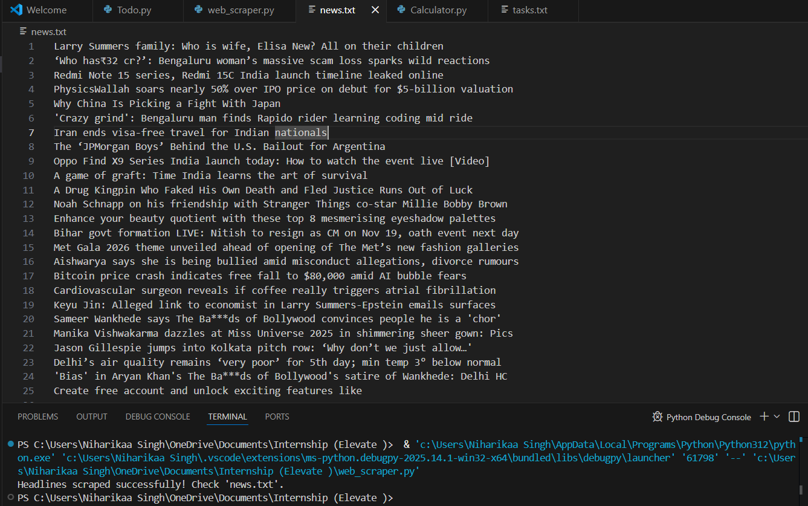

# 📰 News Headlines Web Scraper  

  
  
  
  
  

---

## 📌 **Project Overview**
This Python-based **News Headlines Web Scraper** automatically extracts the latest headlines from a public news website and stores them in a clean text file.  
It uses *Requests* to fetch HTML content and *BeautifulSoup (bs4)* to parse and filter news titles efficiently.  
The goal of this project is to automate data collection and demonstrate understanding of **web scraping, HTML parsing, HTTP requests, and error handling**.

---

## ✨ **Key Features**
- 🔍 Scrapes real-time news headlines from the web  
- 🧠 Uses BeautifulSoup to parse and extract `<h3>` or `<h2>` tags  
- 📁 Automatically stores the results in a `news.txt` file  
- 🛡️ Includes safe error-handling for blocked pages or bad responses  
- 🧩 Works with modern User-Agent headers to avoid 403 errors  
- ⚡ Simple, fast, and lightweight  

---

## 📸 **Output Screenshot**  

